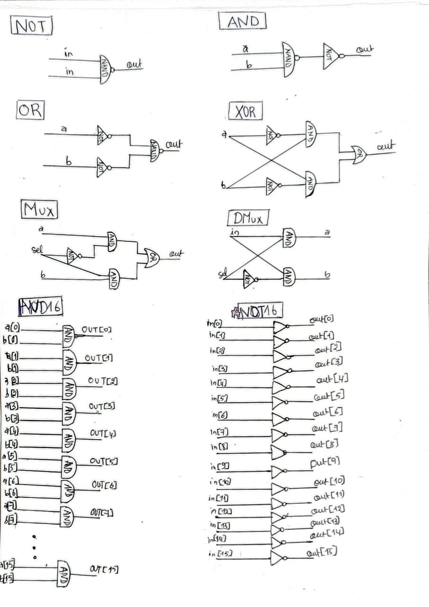
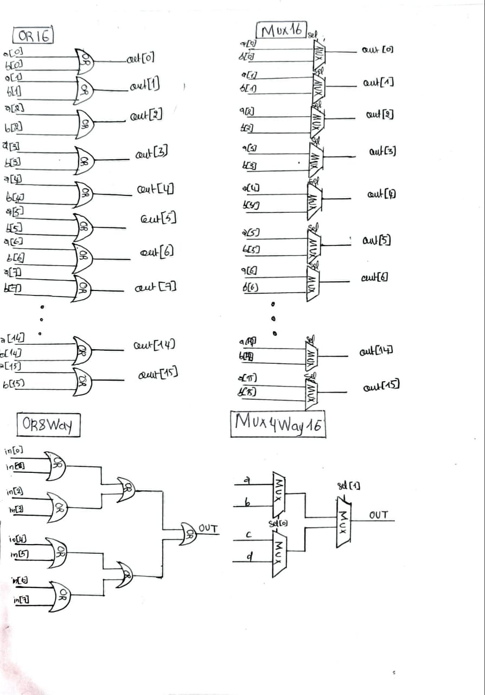
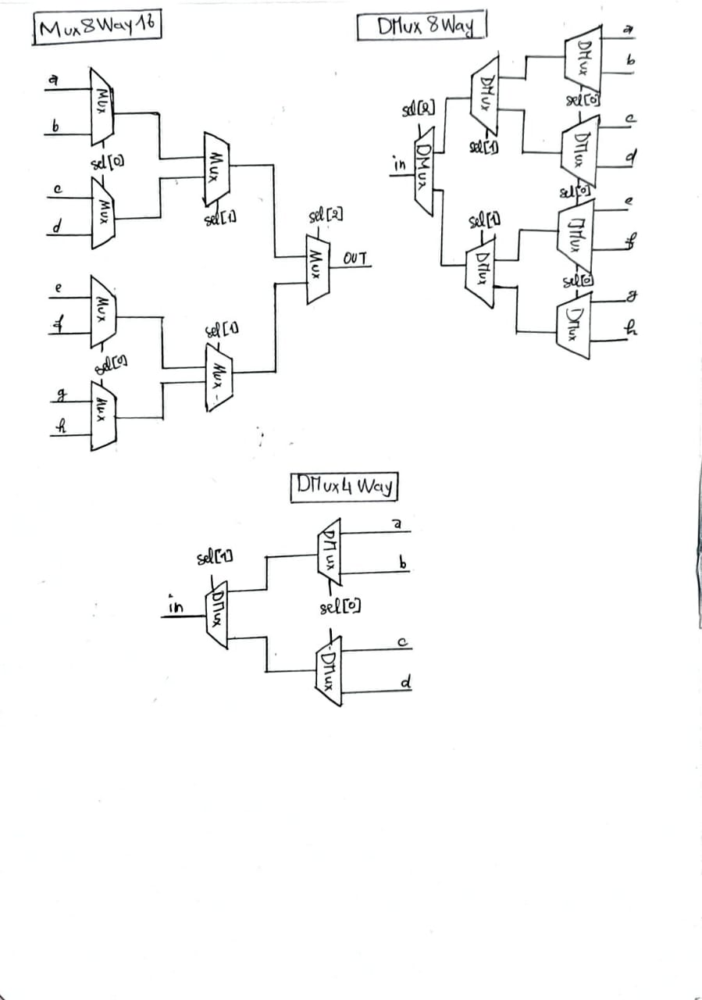
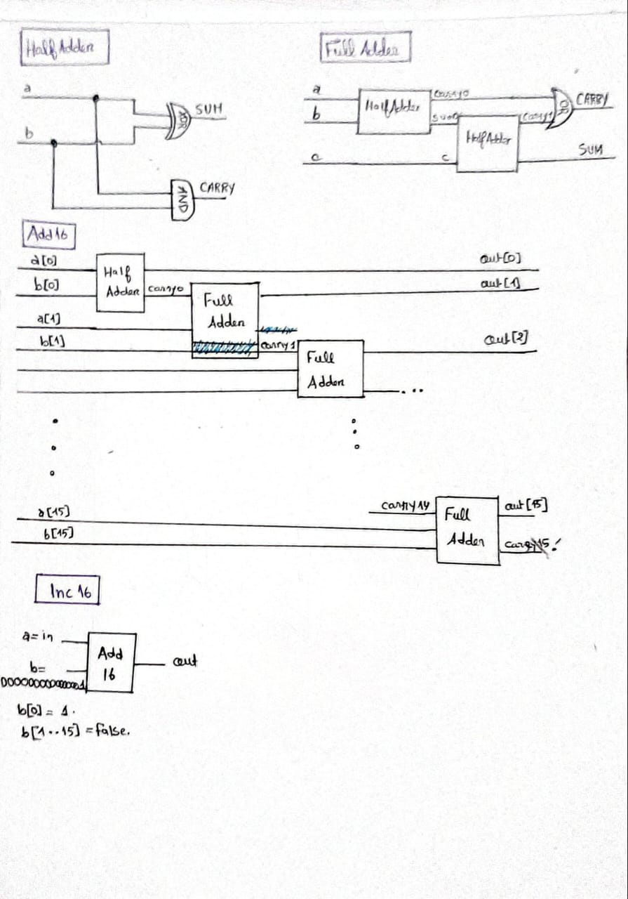
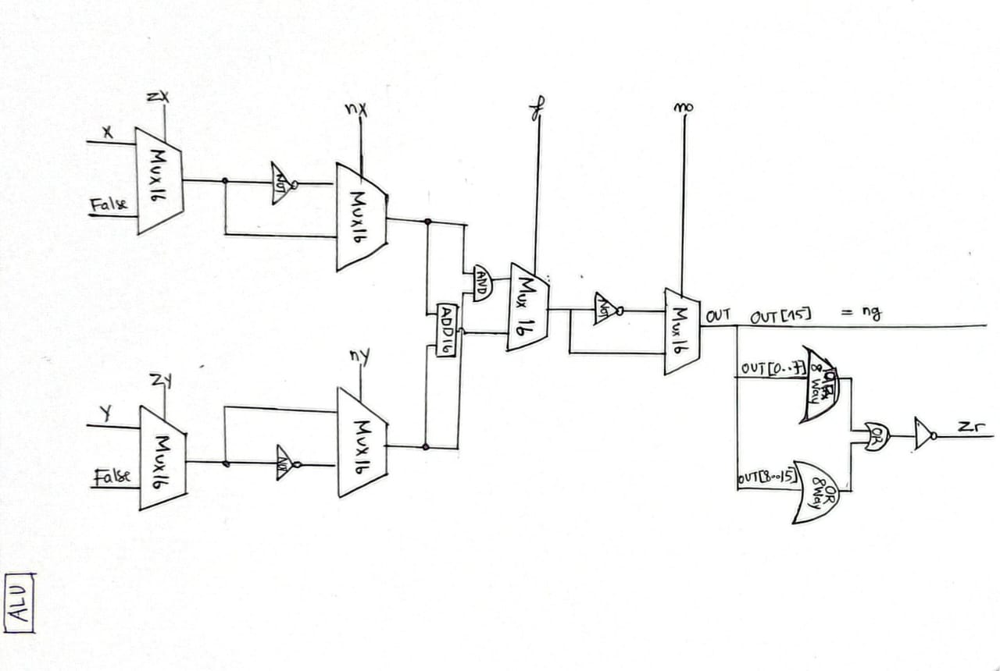
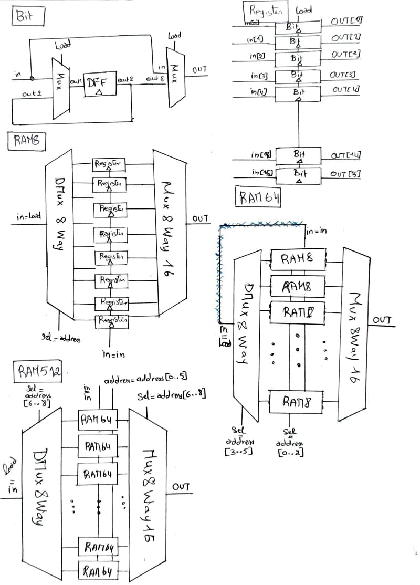
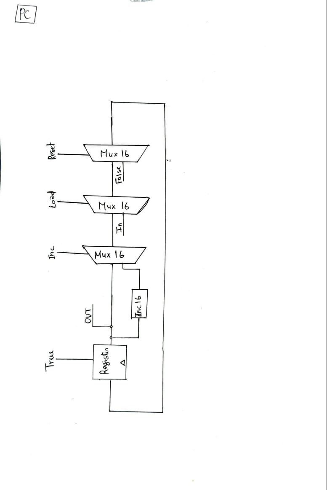

# Nand2tetrisProjects 

My implementations for the projects from the [Nand2Tetris](https://www.nand2tetris.org/) course, where we build a computer from the ground up.

## What's Here

- **Project 1**: Basic logic gates (NAND, AND, OR, etc.)
- **Project 2**: Combinational chips (ALU, adder, etc.)
- **Project 3**: Sequential chips (memory, counters)

## Gate Diagrams

I drew these by hand to better understand how everything connects:

### Basic logic gates
*All built from NAND gate only!
  
  
  
 

### Combinational chips 

### Sequential chips 

## Author
Levannah
